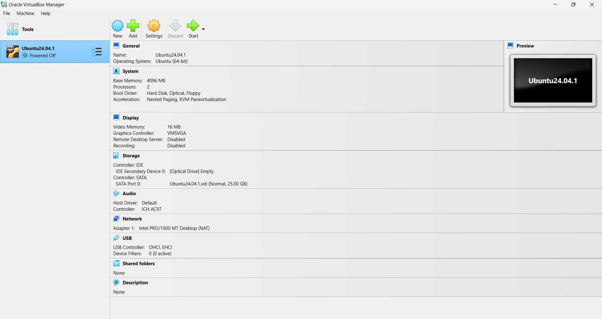

# Part A: Preparation

1. **How to Run an Ubuntu Desktop Virtual Machine Using VirtualBox**  
   [Follow this tutorial](https://ubuntu.com/tutorials/how-to-run-ubuntu-desktop-on-a-virtual-machine-using-virtualbox#1-overview) to set up an Ubuntu Desktop virtual machine on VirtualBox.

3. **Download VirtualBox**  
   You can download VirtualBox from [this link](https://www.virtualbox.org/wiki/Downloads).

4. **Download Ubuntu**  
   You can download Ubuntu from [this link](https://ubuntu.com/download/desktop).

5. **Image of a successful Install**  
   

<br>

---

# Part B: Explore

## Exploring Group and File Permissions in Ubuntu

In this exercise, you will create a new group called `explorers`, add yourself to the group, and experiment with file ownership and permissions.

### Step 1: Exploring Command Lines

1. Open your terminal using Ctrl + Alt + T.
2. Print user and group IDs using `id`:  
   ```
   id
   ```
3. Explore the tree command:
   ```
   tree
   ```
   Install tree (if it's not installed) 
   ```
   sudo apt install tree
   ```

4. Create directory and file, and check with their permissions.
   ```bash
   pwd                        # To check your current directory
   cd Desktop                 # Move to your Desktop
   mkdir Testing              # Create a new directory
   ls -l                      # Check file permission
   cd Testing                 # Change to the new directory
   touch file.txt             # Create a empty text files
   ls -l                      # List the files with their details
   ```

### Step 2: Create and Add Yourself to a New Group
1. Create a new group called explorers:
   ```
   sudo groupadd explorers
   ```

2. Verify that the group was created by listing it in the group file using the grep command:
   ```
   grep explorers /etc/group
   ```

3. Add yourself to the explorers group using the usermod command. Replace $USER with your username, or use the $USER variable:
   ```
   sudo usermod -aG explorers $USER
   ```
4. Login to the newly created group:
   ```
   newgrp explorers
   ```
5. Verify that you have been added to the group by running the groups command:
   ```
   id
   groups
   ```
   You should see explorers listed as one of your groups.


### Step 3: Create and Explore File Permissions

2. Create a new directory under "Testing" and add a file:
   ```bash
   pwd                        # To check your current directory
   mkdir DirA                 # Create a new directory
   cd DirA                    # Change to the new directory
   touch fileA.txt fileB.txt  # Create two empty text files
   ls -l                      # List the files with their details
   ```
   
3. Change the group ownership of file1.txt to the any group you belong:
   ```
   chgrp <groupname> file1.txt
   ```

4. Verify the group ownership change by running the ls -l command:
   ```
   ls -l
   ```
   *What is your output? Let's check together!*
  
<br>

### Congratulations! You have explored command lines in Ubuntu Linux!

<br>

---

# Summary
### 1. Virtual Machines and Ubuntu Exploration
Throughout this session, you have explored how to set up and interact with a Virtual Machine (VM) running Ubuntu. This provided hands-on experience with virtual environments, enabling you to test and experiment with a Linux-based operating system on your own machine.

### 2. Understanding System Permissions and Limitations
While working on Matrix (Seneca’s system), you encountered some limitations regarding administrative privileges. On Matrix, you do not have full access to the system’s root (administrator) functions, which restricts certain actions. However, in your Ubuntu environment, you have more freedom to explore, including using root privileges through the sudo command. This gives you greater control and the ability to perform system-level tasks, which are essential for understanding system administration and user permissions in Linux.

### 3. New Commands
  You were introduced to several key Linux commands that are essential for managing groups and permissions:
  | Command    | Explanation |
  | -------- | ------- |
  | groupadd  | Create new groups |
  | chgrp | Change group ownership |
  | newgrp    | Log in to a new group |
  | groups    | Print the groups the user is in |
  | sudo    | Execute commands with elevated (root) privileges, allowing you to perform administrative tasks safely. |
