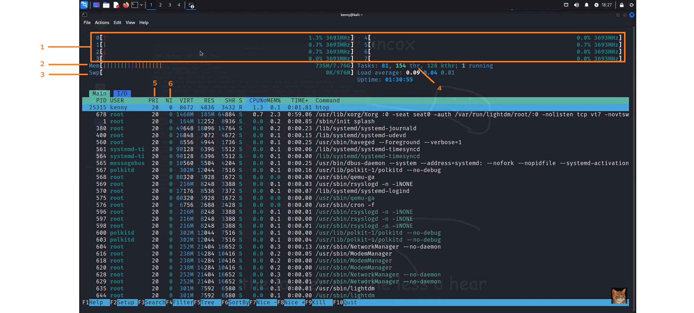

# PART A: Review of Command Lines
Do you still remember all the command-line tools after study week? Let’s do a quick review to get ready for the second half of the semester:  
<strong>60 Linux Commands you NEED to know (in 10 minutes)</strong> 
<a href="https://www.youtube.com/watch?v=gd7BXuUQ91w"> 
    
</a>
## Questions
<ul>
    <li>How many command-lines have you learnt so far?</li>
    <li>Can you find a Windows version?</li>
</ul>
 

# PART B: HTOP
There are three commands you can use to check processes running on your system:
- top
- htop
- btop

In the following video, you’ll gain a deeper understanding of the powerful features in htop for monitoring system processes:  
<strong>All About htop</strong> 
<a href="https://www.youtube.com/watch?v=I6T7nSO-WNg"> 
    
</a>

## Questions
<ol>
  <li>Identify the expanded name of each numbered item (1 - 6): 
      <i>Click to zoom-in the picture</i>
    </li>
  <li>Define the following terms:
    <ul>
      <li>Threads</li>
      <li>Running: What does it mean when a process is "running"?</li>
      <li>Uptime</li>
    </ul>
  </li>
  <li>Explain the roles of PRI and NI.</li>
  <li>Explain the steps to kill a process in htop.</li>
  <li>What is the default signal for killing a process?</li>
</ol>

